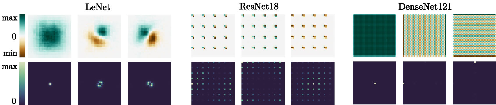

# Neural Anisotropy Directions
This is the source code to reproduce the experiments in the NeuriPS 2020 paper "[Neural Anisotropy Directions](https://arxiv.org/abs/2006.09717)" by Guillermo Ortiz-Jimenez*, Apostolos Modas*, Seyed-Mohsen Moosavi-Dezfooli and Pascal Frossard.

## Abstract
In this work, we analyze the role of the network architecture in shaping the inductive bias of deep classifiers. To that end, we start by focusing on a very simple problem, i.e., classifying a class of linearly separable distributions, and show that, depending on the direction of the discriminative feature of the distribution, many state-of-the-art deep convolutional neural networks (CNNs) have a surprisingly hard time solving this simple task. We then define as *neural anisotropy directions (NADs)* the vectors that encapsulate the directional inductive bias of an architecture. These vectors, which are specific for each architecture and hence act as a signature, encode the preference of a network to separate the input data based on some particular features. We provide an efficient method to identify NADs for several CNN architectures and thus reveal their directional inductive biases. Furthermore, we show that, for the CIFAR-10 dataset, NADs characterize features used by CNNs to discriminate between different classes.



## Dependencies
To run our code on a Linux machine with a GPU, install the Python packages in a fresh Anaconda environment:
```
$ conda env create -f environment.yml
$ conda activate nads
```

## Experiments
This repository contains code to reproduce the following experiments: [Evaluation of CNNs on linearly separable data](directional_bias.py), [computation of NADs](nad_computation.py), and [poison CIFAR-10 experiment](poison_cifar.py). 

You can reproduce this experiments separately using their individual scripts, or have a look at the comprehensive [Jupyter notebook](NADs.ipynb).

## NADs of common architectures

The repository also contains a curated set of precomputed NADs for some common architectures stored as numpy arrays.

Architecture | Computation script
---|---
[Logistic Regression](NADs/LogReg_NADs.npy) | [`logreg_nad.py`](NADs_scripts/logreg_nad.py)
[LeNet](NADs/LeNet_NADs.npy)  | [`lenet_nad.py`](NADs_scripts/lenet_nad.py)
[VGG-11](NADs/VGG11_NADs.npy)  | [`vgg11_nad.py`](NADs_scripts/vgg11_nad.py)
[ResNet-18](NADs/ResNet18_NADs.npy)  | [`resnet18_nad.py`](NADs_scripts/resnet18_nad.py)
[DenseNet-121](NADs/DenseNet121_NADs.npy)  |[`densenet121_nad.py`](NADs_scripts/densenet121_nad.py)

## Reference
If you use this code, please cite the following [paper](https://arxiv.org/abs/2006.09717):

```
@article{OrtizModasNADs2020,
    TITLE = {{Neural Anisotropy Directions}},
    AUTHOR = {{Ortiz-Jimenez}, Guillermo and {Modas}, Apostolos and {Moosavi-Dezfooli}, Seyed-Mohsen and Frossard, Pascal},
    JOURNAL = {arXiv:2006.09717},
    YEAR = {2020},
    MONTH = jun
}
```

```
@InCollection{OrtizModasNADs2020,
    TITLE = {{Neural Anisotropy Directions}},
    AUTHOR = {{Ortiz-Jimenez}, Guillermo and {Modas}, Apostolos and {Moosavi-Dezfooli}, Seyed-Mohsen and Frossard, Pascal},
    BOOKTITLE = {Advances in {{Neural Information Processing Systems}} 34},
    MONTH = dec,
    YEAR = {2020}
}
```
